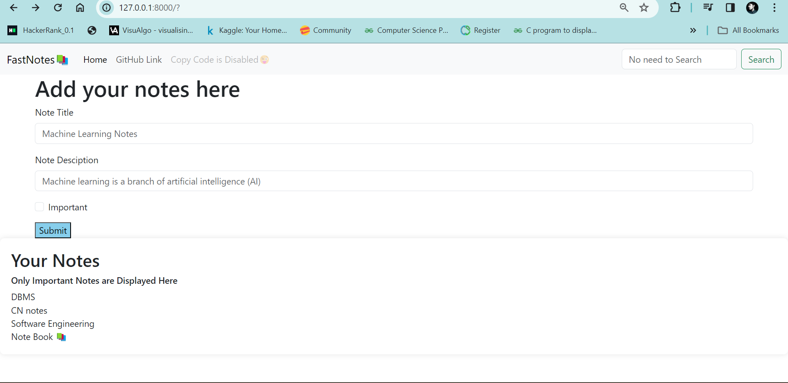
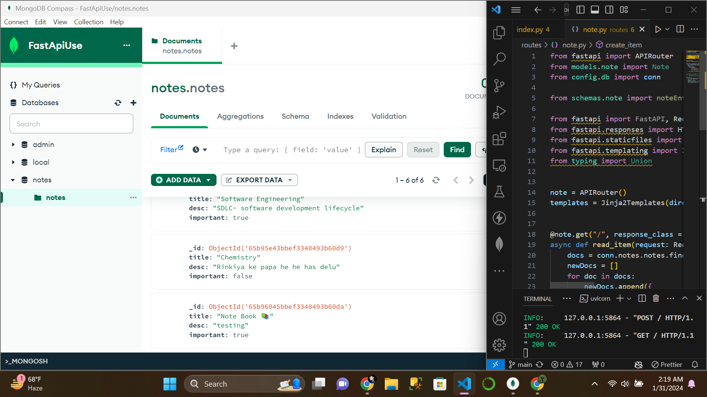
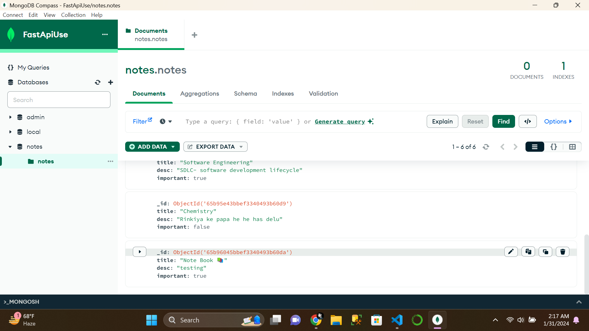

# 📝 Notes Uploading Application

This repository contains a Python application 🐍 built with FastAPI, MongoDB, HTML, and CSS, enabling users to upload and manage their notes.

## Functionalities 🚀

- **Title and Description:** Users can add a title and detailed description to their notes.

- **Importance Checkbox:** Users can mark a note as important using a checkbox. If checked, the note is displayed at the bottom in a separate section for important notes. If unchecked, the note is saved in the database.

## Folder Structure 📂

- **config:** `db.py` - Database and URI configuration.
- **models:** `note.py` - Data validation model or Pydantic model.
- **routes:** `note.py` - Main logic and routing for the application.
- **schemas:** `note.py` - Database schema.
- **static-testing:** Folder for static testing files.
- **templates:** `index.html` - Front-end and interface.
- **venv:** Python virtual environment.

## Files 📄

- **index.py:** Main file. Run this file to start the application.
- **main.py:** Testing file.
- **temp.py:** Testing file.
- **requirements.txt:** List of required libraries for testing.

## Tech Stack ⚙️

- Python
- HTML
- CSS
- FastAPI
- `uvicorn[standard]`
- Jinja2
- PyMongo
- Python-Multipart

## Installation 🛠️

```bash
pip install -r requirements.txt
```
## Running the Application ▶️

To run the application, type the following command in your console:

```bash
uvicorn index:app --reload
```
## Usage 🚀
- Fork this repository.
- Run the application following the instructions in the "Running the Application" section.
- Explore the functionality and manage your notes.
- Thank you for your interest!



